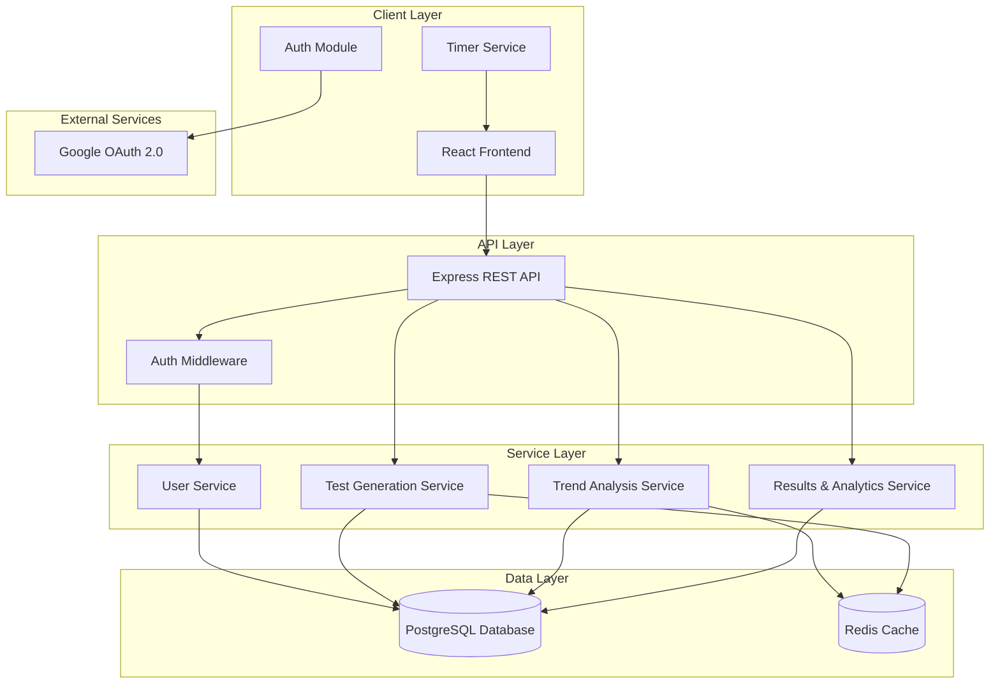

# GATE COMPASS - Design Document

## Overview

GATE COMPASS is a full-stack web application designed to help GATE CSIT aspirants prepare effectively through intelligent mock test generation, comprehensive analytics, and personalized feedback. The platform leverages trend analysis of historical GATE questions to prioritize important concepts and generates practice tests from standard textbooks.

The system follows a modern web architecture with a React-based frontend, Node.js/Express backend, and PostgreSQL database. Authentication is handled via Google OAuth 2.0, ensuring secure and seamless user access.

## Architecture

### High-Level Architecture



### Technology Stack

**Frontend:**
- React 18 with TypeScript
- React Router for navigation
- Axios for API communication
- Material-UI (MUI) for UI components
- React Context API for state management
- Chart.js for analytics visualization

**Backend:**
- Node.js with Express.js
- TypeScript
- Passport.js with Google OAuth strategy
- JWT for session management
- Node-cron for scheduled tasks

**Database:**
- PostgreSQL for persistent data storage
- Redis for caching trend analysis and session data

**Authentication:**
- Google OAuth 2.0

## Components and Interfaces

### Frontend Components

#### 1. Authentication Module
- **LoginPage**: Displays Google login button and handles OAuth flow
- **AuthContext**: Manages authentication state across the application
- **ProtectedRoute**: HOC for route protection requiring authentication

#### 2. Dashboard Module
- **DashboardPage**: Main landing page showing user statistics and quick actions
- **TrendVisualization**: Displays concept trends with charts and graphs
- **TestHistory**: Shows previous test attempts with scores

#### 3. Test Module
- **TestConfiguration**: Allows users to configure test parameters
- **TestInterface**: Main test-taking interface with question display
- **QuestionPalette**: Navigation panel showing all questions and their status
- **Timer**: Countdown timer component with visual indicators
- **QuestionTracker**: Tracks time spent per question

#### 4. Results Module
- **ResultsPage**: Displays test scores and detailed breakdown
- **ConceptAnalysis**: Shows performance by concept with charts
- **FeedbackPanel**: Displays personalized suggestions and recommendations
- **SolutionViewer**: Shows correct answers with explanations

#### 5. Admin Module
- **QuestionManager**: Interface for adding/editing questions
- **DataImporter**: Bulk import tool for previous years' questions
- **ConceptMapper**: Tool for mapping questions to concepts

### Backend Services

#### 1. AuthService
```typescript
interface AuthService {
  authenticateWithGoogle(code: string): Promise<AuthToken>
  validateToken(token: string): Promise<User>
  refreshToken(refreshToken: string): Promise<AuthToken>
  logout(userId: string): Promise<void>
}
```

#### 2. TrendAnalysisService
```typescript
interface TrendAnalysisService {
  analyzeTrends(): Promise<ConceptTrend[]>
  getConceptRanking(): Promise<ConceptRanking[]>
  updateTrendsWithNewData(questions: Question[]): Promise<void>
  getCachedTrends(): Promise<ConceptTrend[]>
}
```

#### 3. TestGenerationService
```typescript
interface TestGenerationService {
  generateMockTest(userId: string, config: TestConfig): Promise<Test>
  selectQuestionsByTrend(count: number, concepts: string[]): Promise<Question[]>
  balanceQuestionDifficulty(questions: Question[]): Question[]
  createTestSession(userId: string, testId: string): Promise<TestSession>
}
```

#### 4. TestSessionService
```typescript
interface TestSessionService {
  startTest(sessionId: string): Promise<TestSession>
  saveAnswer(sessionId: string, questionId: string, answer: Answer): Promise<void>
  trackQuestionTime(sessionId: string, questionId: string, timeSpent: number): Promise<void>
  submitTest(sessionId: string): Promise<TestResult>
  autoSubmitOnTimeout(sessionId: string): Promise<TestResult>
}
```

#### 5. ResultsService
```typescript
interface ResultsService {
  calculateScore(session: TestSession): Promise<TestResult>
  analyzeConceptPerformance(session: TestSession): Promise<ConceptPerformance[]>
  generateFeedback(performance: ConceptPerformance[]): Promise<Feedback>
  getRecommendations(weakConcepts: Concept[]): Promise<Recommendation[]>
  getHistoricalPerformance(userId: string): Promise<PerformanceHistory>
}
```

### API Endpoints

#### Authentication
- `POST /api/auth/google` - Initiate Google OAuth flow
- `POST /api/auth/callback` - Handle OAuth callback
- `POST /api/auth/refresh` - Refresh access token
- `POST /api/auth/logout` - Logout user

#### Trends
- `GET /api/trends` - Get concept trends and rankings
- `POST /api/trends/refresh` - Trigger trend recalculation (admin)

#### Tests
- `POST /api/tests/generate` - Generate new mock test
- `GET /api/tests/:testId` - Get test details
- `POST /api/tests/:testId/start` - Start test session
- `PUT /api/tests/sessions/:sessionId/answer` - Save answer
- `PUT /api/tests/sessions/:sessionId/time` - Update question time
- `POST /api/tests/sessions/:sessionId/submit` - Submit test

#### Results
- `GET /api/results/:sessionId` - Get test results
- `GET /api/results/:sessionId/analysis` - Get detailed analysis
- `GET /api/results/user/:userId/history` - Get user's test history

#### Admin
- `POST /api/admin/questions` - Add questions
- `PUT /api/admin/questions/:id` - Update question
- `POST /api/admin/questions/import` - Bulk import questions
- `PUT /api/admin/concepts/mapping` - Update concept mappings

## Data Models

### User
```typescript
interface User {
  id: string
  googleId: string
  email: string
  name: string
  profilePicture: string
  createdAt: Date
  lastLoginAt: Date
}
```

### Question
```typescript
interface Question {
  id: string
  content: string
  options: Option[]
  correctAnswer: string
  explanation: string
  concept: string
  subConcept?: string
  difficulty: 'easy' | 'medium' | 'hard'
  source: string // Textbook reference
  yearAppeared?: number // If from previous GATE papers
  createdAt: Date
}

interface Option {
  id: string
  text: string
}
```

### Concept
```typescript
interface Concept {
  id: string
  name: string
  category: string
  description: string
}

interface ConceptTrend {
  conceptId: string
  conceptName: string
  frequency: number
  importance: number
  yearlyDistribution: YearlyData[]
  lastUpdated: Date
}

interface YearlyData {
  year: number
  count: number
}
```

### Test
```typescript
interface Test {
  id: string
  questions: Question[]
  totalQuestions: number
  duration: number // in seconds (10800 for 3 hours)
  createdAt: Date
}

interface TestConfig {
  questionCount: number
  focusConcepts?: string[]
  difficultyDistribution?: DifficultyDistribution
}

interface DifficultyDistribution {
  easy: number
  medium: number
  hard: number
}
```

### TestSession
```typescript
interface TestSession {
  id: string
  userId: string
  testId: string
  startTime: Date
  endTime?: Date
  status: 'in_progress' | 'completed' | 'auto_submitted'
  answers: SessionAnswer[]
  questionTimes: QuestionTime[]
  totalTimeSpent: number
}

interface SessionAnswer {
  questionId: string
  selectedAnswer: string
  markedForReview: boolean
  answeredAt: Date
}

interface QuestionTime {
  questionId: string
  timeSpent: number // in seconds
}
```

### TestResult
```typescript
interface TestResult {
  id: string
  sessionId: string
  userId: string
  score: number
  totalQuestions: number
  correctAnswers: number
  incorrectAnswers: number
  unanswered: number
  percentage: number
  conceptPerformance: ConceptPerformance[]
  feedback: Feedback
  createdAt: Date
}

interface ConceptPerformance {
  conceptId: string
  conceptName: string
  totalQuestions: number
  correctAnswers: number
  accuracy: number
  averageTimePerQuestion: number
}

interface Feedback {
  overallMessage: string
  strengths: string[]
  weaknesses: ConceptWeakness[]
  recommendations: Recommendation[]
}

interface ConceptWeakness {
  conceptName: string
  accuracy: number
  questionsAttempted: number
}

interface Recommendation {
  conceptName: string
  textbookChapters: string[]
  practiceTopics: string[]
  priority: 'high' | 'medium' | 'low'
}
```


## Correctness Properties

*A property is a characteristic or behavior that should hold true across all valid executions of a system-essentially, a formal statement about what the system should do. Properties serve as the bridge between human-readable specifications and machine-verifiable correctness guarantees.*

### Property 1: OAuth redirect correctness
*For any* user clicking the Google login button, the system should redirect to Google's OAuth page with valid client ID, redirect URI, and required scopes.
**Validates: Requirements 1.2**

### Property 2: User profile creation or retrieval
*For any* successful Google authentication response, the system should either create a new user profile (if googleId doesn't exist) or retrieve the existing user profile (if googleId exists), and in both cases grant platform access.
**Validates: Requirements 1.3**

### Property 3: Authentication error handling
*For any* failed Google authentication attempt, the system should display an appropriate error message and maintain the login interface in a state that allows retry.
**Validates: Requirements 1.4**

### Property 4: Session persistence
*For any* authenticated user with a valid session token, returning to the platform should grant access without requiring re-authentication.
**Validates: Requirements 1.5**

### Property 5: Question categorization completeness
*For any* set of previous years' questions processed by the system, every question should be assigned to exactly one primary concept.
**Validates: Requirements 2.1**

### Property 6: Frequency calculation correctness
*For any* concept in the system, the calculated frequency metric should equal the count of questions tagged with that concept divided by the total number of questions, across all years.
**Validates: Requirements 2.2**

### Property 7: Ranking monotonicity
*For any* two concepts A and B, if concept A has higher frequency than concept B, then concept A should be ranked higher (lower rank number) than concept B in the trend rankings.
**Validates: Requirements 2.3**

### Property 8: Trend display completeness
*For any* concept in the trend rankings, the displayed trend data should include the concept name, frequency, importance score, and yearly distribution.
**Validates: Requirements 2.4**

### Property 9: Trend freshness
*For any* addition of new previous years' questions to the system, the trend analysis should be updated to include these questions in frequency and importance calculations.
**Validates: Requirements 2.5, 8.4**

### Property 10: Test generation from question bank
*For any* generated mock test, all questions in the test should exist in the question bank and have valid concept associations.
**Validates: Requirements 3.1**

### Property 11: High-importance concept prioritization
*For any* generated mock test, questions from concepts in the top 30% of importance rankings should appear more frequently than questions from concepts in the bottom 30%.
**Validates: Requirements 3.2**

### Property 12: Textbook source validity
*For any* question in a generated mock test, the question should have a non-empty source field referencing a standard textbook.
**Validates: Requirements 3.3**

### Property 13: Difficulty distribution conformance
*For any* mock test generated with a specified difficulty distribution (e.g., 30% easy, 50% medium, 20% hard), the actual distribution of questions should match the specification within a 10% tolerance.
**Validates: Requirements 3.4**

### Property 14: Test session ID uniqueness
*For any* two test sessions created by the system, they should have different session IDs.
**Validates: Requirements 3.5**

### Property 15: Timer initialization
*For any* test session started by a user, the countdown timer should be initialized to exactly 10800 seconds (3 hours).
**Validates: Requirements 4.1**

### Property 16: Timer display accuracy
*For any* active test session, the displayed remaining time should match the actual elapsed time subtracted from the initial 10800 seconds.
**Validates: Requirements 4.2**

### Property 17: Auto-submission on timeout
*For any* test session where the timer reaches zero, the system should automatically submit the test and prevent any further answer modifications.
**Validates: Requirements 4.3**

### Property 18: Timer continuity during navigation
*For any* test session, navigating between questions should not reset, pause, or otherwise affect the countdown timer state.
**Validates: Requirements 4.4**

### Property 19: Manual submission timer handling
*For any* test session manually submitted before the timer expires, the system should stop the timer and record the actual elapsed time as the total time taken.
**Validates: Requirements 4.5**

### Property 20: Cumulative question time tracking
*For any* question in a test session, if a user views the question multiple times, the total time spent should equal the sum of all individual viewing durations.
**Validates: Requirements 5.1, 5.2, 5.3**

### Property 21: Question time persistence
*For any* completed test session, the system should have stored time data for every question that was viewed at least once during the session.
**Validates: Requirements 5.4**

### Property 22: Time display in results
*For any* test result viewed by a user, each question should display the time spent on that question alongside the answer information.
**Validates: Requirements 5.5**

### Property 23: Navigation state preservation
*For any* question in an active test session, if a user enters an answer, navigates away, and then returns to that question, the previously entered answer should still be present.
**Validates: Requirements 6.2, 6.5**

### Property 24: Review flag persistence
*For any* question marked for review during a test session, the review flag should persist throughout the session and be visible in the question palette.
**Validates: Requirements 6.3**

### Property 25: Question palette status accuracy
*For any* question in the palette, its displayed status (answered/unanswered/marked for review) should accurately reflect the current state of that question in the test session.
**Validates: Requirements 6.4**

### Property 26: Score calculation correctness
*For any* submitted test session, the calculated score should equal the number of questions where the user's selected answer matches the correct answer.
**Validates: Requirements 7.1**

### Property 27: Results completeness
*For any* test result, each question should display the user's response, the correct answer, and an explanation.
**Validates: Requirements 7.2**

### Property 28: Concept-wise accuracy calculation
*For any* concept in the test results, the accuracy percentage should equal (correct answers for that concept / total questions for that concept) × 100.
**Validates: Requirements 7.3**

### Property 29: Weak concept identification
*For any* concept in the test results with accuracy below 60%, the system should classify it as a weak concept and include it in the feedback section.
**Validates: Requirements 7.4**

### Property 30: Recommendation generation for weak concepts
*For any* concept identified as weak, the feedback should include specific textbook chapter recommendations for that concept.
**Validates: Requirements 7.5**

### Property 31: Historical performance aggregation
*For any* user with multiple completed test sessions, the historical performance view should include data from all completed sessions ordered by date.
**Validates: Requirements 7.6**

### Property 32: Question validation
*For any* question submitted by an administrator, if it lacks required metadata (concept, difficulty, or source), the system should reject the submission with a validation error.
**Validates: Requirements 8.1**

### Property 33: Import parsing correctness
*For any* batch of previous years' questions imported, each question should be parsed and assigned a concept category before being added to the question bank.
**Validates: Requirements 8.2**

### Property 34: Referential integrity preservation
*For any* existing test session, if a question in that session is updated, the session should still maintain a valid reference to the question (by ID).
**Validates: Requirements 8.3**

### Property 35: Bulk operation feedback
*For any* bulk operation (import/update) processing N items, the system should report progress updates and provide error details for any failed items.
**Validates: Requirements 8.5**

## Error Handling

### Authentication Errors
- **OAuth Failures**: Display user-friendly error messages for network issues, denied permissions, or invalid tokens
- **Session Expiry**: Automatically redirect to login page with a message indicating session expiration
- **Token Refresh Failures**: Attempt token refresh once; if failed, require re-authentication

### Test Generation Errors
- **Insufficient Questions**: If the question bank lacks enough questions for the requested test configuration, notify the user and suggest alternative configurations
- **Trend Data Unavailable**: If trend analysis hasn't been performed, use equal weighting for all concepts and notify admin

### Test Session Errors
- **Network Interruptions**: Implement auto-save every 30 seconds; restore session state on reconnection
- **Browser Crashes**: Store session state in localStorage; allow session recovery on return
- **Concurrent Sessions**: Prevent users from starting multiple test sessions simultaneously

### Data Validation Errors
- **Invalid Question Format**: Reject questions with validation errors and provide specific error messages
- **Missing Metadata**: Require all mandatory fields before allowing question submission
- **Duplicate Questions**: Check for duplicates based on content hash and warn administrators

### System Errors
- **Database Failures**: Implement retry logic with exponential backoff; log errors for admin review
- **Cache Failures**: Fall back to database queries if Redis is unavailable
- **Calculation Errors**: Log errors and use fallback values; notify administrators

## Testing Strategy

### Unit Testing
The system will use **Jest** for unit testing with the following focus areas:

- **Service Layer Logic**: Test individual service methods with mocked dependencies
- **Calculation Functions**: Test score calculation, accuracy computation, and trend analysis algorithms
- **Validation Functions**: Test input validation for questions, user data, and test configurations
- **Utility Functions**: Test date/time utilities, formatting functions, and helper methods

Example unit tests:
- Test that score calculation correctly counts matching answers
- Test that difficulty distribution validation rejects invalid percentages
- Test that concept frequency calculation handles edge cases (zero questions, single concept)

### Property-Based Testing
The system will use **fast-check** (for TypeScript/JavaScript) for property-based testing with a minimum of 100 iterations per property.

Each property-based test will:
- Be tagged with a comment explicitly referencing the correctness property from this design document
- Use the format: `// Feature: gate-compass, Property {number}: {property_text}`
- Generate random but valid inputs to verify universal properties
- Run at least 100 iterations to ensure statistical confidence

Example property-based tests:
- **Property 6**: Generate random sets of questions with concepts; verify frequency calculations are correct
- **Property 13**: Generate random difficulty distributions; verify generated tests match specifications
- **Property 20**: Generate random navigation sequences; verify cumulative time tracking is accurate
- **Property 26**: Generate random test sessions with answers; verify score calculations are correct

### Integration Testing
- **API Endpoint Testing**: Test complete request/response cycles for all endpoints
- **Authentication Flow**: Test complete OAuth flow from login to authenticated requests
- **Test Session Flow**: Test complete flow from test generation through submission to results
- **Database Operations**: Test CRUD operations with actual database connections

### End-to-End Testing
- **User Journeys**: Test complete user workflows using Playwright or Cypress
- **Critical Paths**: Login → Generate Test → Take Test → View Results
- **Timer Functionality**: Verify timer behavior across page refreshes and navigation
- **Multi-User Scenarios**: Test concurrent users taking different tests

## Performance Considerations

### Caching Strategy
- **Trend Analysis**: Cache trend results in Redis with 24-hour TTL; refresh daily via cron job
- **Question Bank**: Cache frequently accessed questions to reduce database load
- **User Sessions**: Store active test sessions in Redis for fast access

### Database Optimization
- **Indexing**: Create indexes on frequently queried fields (userId, conceptId, testId, sessionId)
- **Query Optimization**: Use pagination for large result sets; limit joins where possible
- **Connection Pooling**: Implement connection pooling to handle concurrent users efficiently

### Frontend Optimization
- **Code Splitting**: Lazy load routes and components to reduce initial bundle size
- **Memoization**: Use React.memo and useMemo for expensive computations
- **Debouncing**: Debounce auto-save operations to reduce API calls

### Scalability
- **Horizontal Scaling**: Design stateless API servers that can be scaled horizontally
- **Load Balancing**: Use load balancer to distribute traffic across multiple server instances
- **Database Replication**: Implement read replicas for query-heavy operations

## Security Considerations

### Authentication & Authorization
- **OAuth 2.0**: Use Google OAuth for secure authentication
- **JWT Tokens**: Implement short-lived access tokens (15 minutes) with refresh tokens
- **Token Storage**: Store tokens in httpOnly cookies to prevent XSS attacks
- **Role-Based Access**: Implement admin role checks for administrative endpoints

### Data Protection
- **Input Sanitization**: Sanitize all user inputs to prevent SQL injection and XSS
- **Rate Limiting**: Implement rate limiting on API endpoints to prevent abuse
- **HTTPS Only**: Enforce HTTPS for all communications
- **Data Encryption**: Encrypt sensitive data at rest in the database

### Session Security
- **Session Timeout**: Implement automatic session timeout after 24 hours of inactivity
- **CSRF Protection**: Use CSRF tokens for state-changing operations
- **Secure Cookies**: Set secure, httpOnly, and sameSite flags on cookies

## Deployment Architecture

### Development Environment
- Local development with Docker Compose
- PostgreSQL and Redis containers
- Hot reload for frontend and backend

### Production Environment
- **Frontend**: Deployed on Vercel or Netlify with CDN
- **Backend**: Deployed on AWS EC2 or Heroku with auto-scaling
- **Database**: AWS RDS PostgreSQL with automated backups
- **Cache**: AWS ElastiCache Redis
- **Monitoring**: CloudWatch for logs and metrics
- **CI/CD**: GitHub Actions for automated testing and deployment

## Future Enhancements

1. **Adaptive Testing**: Adjust question difficulty based on user performance in real-time
2. **Peer Comparison**: Show how user performance compares to other aspirants
3. **Study Plans**: Generate personalized study plans based on weak concepts
4. **Video Explanations**: Add video explanations for complex questions
5. **Mobile App**: Develop native mobile applications for iOS and Android
6. **Offline Mode**: Allow users to download tests and take them offline
7. **Discussion Forums**: Add community features for users to discuss questions
8. **AI-Powered Insights**: Use machine learning to predict exam patterns and generate better recommendations
